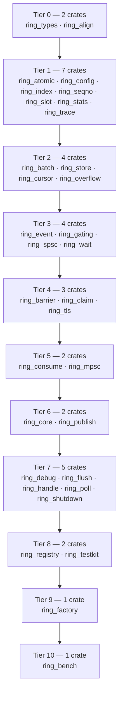

# ring

Ring Factory is a lock-free write path that lets many concurrent producer
threads submit work to a single ordered consumer without contending on a
shared lock, eliminating the lock-convoy jitter that would erode a tight
latency budget under load. Its claim, publish, and commit protocol is
designed as a reusable foundation for latency-critical, strictly-ordered
systems such as order-matching engines, where many concurrent order
submissions must funnel into one deterministic, low-latency decision stream.

*A 34-crate concurrency write path, decomposed one mechanism per crate —
unsafe forbidden by default, and nothing gets adopted without first winning
a measured benchmark.*

The concurrency write-path family: 33 `ring_*` mechanism crates plus
`bench_harness`, its family-neutral stage-gate and workload oracle. All 34
are for-keeps, non-demo crates, and together they form this repository's own
Cargo workspace ([`Cargo.toml`](Cargo.toml)). The family was extracted into
this standalone repository on 2026-09-29, after an earlier internal
reorganization had already consolidated it into a single top-level directory
so its dependency graph was no longer nested inside an unrelated crate set.

## Architecture

The dependency graph is rooted at `ring_types` and `ring_align` — the only
two crates with no `ring_*` dependency of their own — and is acyclic by
construction: [`Cargo.toml`](Cargo.toml)'s member list is in dependency
order, so a cycle would fail to build. That ordering is the whole build
order — nothing further is needed to bring the family up from nothing.
Eleven tiers deep, computed from the crates' own manifests rather than
asserted:

`bench_harness` sits outside this graph entirely — family-neutral validation
machinery with no `ring_*` dependency, grading several crate families from
outside all of them (→ [`bench_harness/readme.md`](bench_harness/readme.md)).
Only five of the 33 are meant to be depended on from outside the family:
`ring_types`, `ring_handle`, `ring_tls`, `ring_flush`, and `ring_factory` —
the rest are internal to the family's own composition.

## Why in-house, not off-the-shelf

**Reasons, at a glance:**

1. Determinism needs a reproducible total order
2. Exact shape: many producers, one ordered consumer
3. Generic queues lock-convoy under this access pattern
4. Adoption requires winning a measured benchmark
5. One shared mechanism avoids duplicating correctness bugs
6. Off-the-shelf kept permanently where it demonstrably fits
7. Known pattern re-implemented in-house, not invented
8. One crate per concern enables focused verification

The 33 mechanism crates exist because the property they implement — a
slot-shaped channel with exactly-once delivery and a *reproducible total
order* — is a correctness requirement a deterministic consumer depends on,
not a performance preference a general-purpose crate happens to satisfy.
Adoption is gated on benchmarking in-house pattern candidates against each
other on this project's own workload, never on a crates.io survey
([`ring_mpsc/docs/non_functional_requirement/001_measured_before_adopted.md`](ring_mpsc/docs/non_functional_requirement/001_measured_before_adopted.md)).

One crate is the deliberate exception. `ring_core` absorbs `crossbeam-queue`
as a feature-gated interim backend, so consumers are not blocked on the
in-house rings earning the operating history `ring_bench` exists to produce —
the full reasoning, its costs, and its exact removal condition are recorded in
[`ring_core/docs/workaround/001_crossbeam_queue_as_interim_backend.md`](ring_core/docs/workaround/001_crossbeam_queue_as_interim_backend.md).

## Crates

| Directory | Responsibility |
|-----------|-----------------|
| [`bench_harness/`](bench_harness/readme.md) | Stage gates and workload oracle for several crate families, this one included — depends on no `ring_*` crate |
| [`ring_types/`](ring_types/readme.md) | Shared ids, errors, and policy enums for the ring family — no ring logic |
| [`ring_seqno/`](ring_seqno/readme.md) | Sequence numbers and their wrapping arithmetic |
| [`ring_index/`](ring_index/readme.md) | Sequence-to-slot index mapping for power-of-two capacities |
| [`ring_align/`](ring_align/readme.md) | Cache-line padding constants and alignment wrappers |
| [`ring_atomic/`](ring_atomic/readme.md) | Atomic sequence helpers with explicit memory orderings |
| [`ring_config/`](ring_config/readme.md) | Ring construction parameters |
| [`ring_slot/`](ring_slot/readme.md) | Slot payload views — typed and raw bytes |
| [`ring_cursor/`](ring_cursor/readme.md) | Producer and consumer sequence cursors, cache-line separated |
| [`ring_store/`](ring_store/readme.md) | Power-of-two slot storage array |
| [`ring_wait/`](ring_wait/readme.md) | Wait strategies for space and data availability |
| [`ring_gating/`](ring_gating/readme.md) | Producer gating so it never laps the slowest consumer |
| [`ring_barrier/`](ring_barrier/readme.md) | Consumer barrier over the minimum of dependent cursors |
| [`ring_claim/`](ring_claim/readme.md) | Sequence-range claiming without waiting |
| [`ring_publish/`](ring_publish/readme.md) | Publication of claimed slots to consumers |
| [`ring_consume/`](ring_consume/readme.md) | Single-consumer available-range computation and commit |
| [`ring_overflow/`](ring_overflow/readme.md) | Full-ring overflow policies |
| [`ring_batch/`](ring_batch/readme.md) | Batch claim objects spanning a sequence range |
| [`ring_event/`](ring_event/readme.md) | Slot translators that fill a claimed slot |
| [`ring_spsc/`](ring_spsc/readme.md) | Single-producer single-consumer ring API |
| [`ring_mpsc/`](ring_mpsc/readme.md) | Multi-producer single-consumer ring API |
| [`ring_core/`](ring_core/readme.md) | Composed ring over an SPSC or MPSC core with overflow, batch, and event support |
| [`ring_handle/`](ring_handle/readme.md) | Shareable producer and consumer ends |
| [`ring_tls/`](ring_tls/readme.md) | Thread-local staging buffers ahead of a ring flush |
| [`ring_flush/`](ring_flush/readme.md) | Flush policies deciding when thread-local staging reaches the ring |
| [`ring_stats/`](ring_stats/readme.md) | Ring counters |
| [`ring_shutdown/`](ring_shutdown/readme.md) | Publisher stop, drain, and waiter join |
| [`ring_poll/`](ring_poll/readme.md) | Non-blocking progress helpers |
| [`ring_registry/`](ring_registry/readme.md) | Named ring registry |
| [`ring_factory/`](ring_factory/readme.md) | Ring construction from configuration |
| [`ring_trace/`](ring_trace/readme.md) | Optional sequence-operation trace log |
| [`ring_debug/`](ring_debug/readme.md) | Runtime invariant checks over a live ring |
| [`ring_testkit/`](ring_testkit/readme.md) | Determinism-test fixtures driving scripted claim and drain sequences |
| [`ring_bench/`](ring_bench/readme.md) | Comparative write-path measurements — mutex, ring, and thread-local staging |

## Tooling

| Directory | Responsibility |
|-----------|-----------------|
| [`verb/`](verb/readme.md) | do-protocol verb scripts (`test`, `lint`, `gate`, ...) — not a crate, no `Cargo.toml` |
