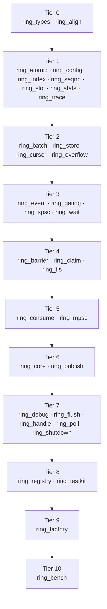

# ring

Ring Factory is a lock-free write path. It lets many concurrent producer
threads submit work to a single ordered consumer without contending on a
shared lock, so there is no lock-convoy jitter to erode a tight latency
budget under load. Its claim, publish, and commit protocol is designed for
reuse in latency-critical, strictly-ordered systems such as order-matching
engines, where many concurrent order submissions must funnel into one
deterministic, low-latency decision stream.

*A concurrency write path, one mechanism per crate. Unsafe is
forbidden by default, and nothing gets adopted without first winning a
measured benchmark.*


[](https://github.com/Wandalen/ring/actions/workflows/ci.yml)
[](https://github.com/Wandalen/ring/actions/workflows/gates.yml)
[](https://github.com/Wandalen/ring/actions/workflows/loom.yml)
[](https://github.com/Wandalen/ring/actions/workflows/benchmarks.yml)

The family is the `ring_*` mechanism crates plus `bench_harness`, its
family-neutral stage-gate and workload oracle. Together they form this
repository's Cargo workspace ([`Cargo.toml`](Cargo.toml)), with
[`perf/`](perf/readme.md), the benchmark suite, beside them.

## Quickstart

`ring_factory` is the family's entry point. You reach the other crates
through it instead of importing them directly:

```rust
use ring_factory::{ Factory, RingConfig };

let cfg = RingConfig::new( 8 )?;
let mut ring = Factory.build::< u32 >( cfg )?;
let ( mut producer, mut consumer ) = ring.ends().split();

producer.try_push( 7 )?;
assert_eq!( consumer.drain().next(), Some( 7 ) );
```

See [`ring_factory/readme.md`](ring_factory/readme.md) for construction
options and [`ring_handle/readme.md`](ring_handle/readme.md) for what the
producer/consumer split does and doesn't allow.

## Architecture

The dependency graph is rooted at `ring_types` and `ring_align`, the only
two crates with no `ring_*` dependency of their own. It is acyclic by
construction. [`Cargo.toml`](Cargo.toml)'s member list is in dependency
order, so a cycle would fail to build. That ordering is the whole build
order, and nothing further is needed to bring the family up from nothing.
Each crate's tier is one more than the deepest tier among its dependencies,
dev-dependencies included:



`bench_harness` sits outside this graph. It is family-neutral validation
machinery with no `ring_*` dependency, and it grades the family from outside
it (see [`bench_harness/readme.md`](bench_harness/readme.md)). Only these crates
are meant to be depended on from outside the family: `ring_types`,
`ring_handle`, `ring_tls`, `ring_flush`, and `ring_factory`.
The rest are internal to the family's own composition.

## Why in-house, not off-the-shelf

Reasons, at a glance:

1. Determinism needs a reproducible total order
2. Exact shape: many producers, one ordered consumer
3. Generic queues lock-convoy under this access pattern
4. Adoption requires winning a measured benchmark
5. One shared mechanism avoids duplicating correctness bugs
6. Off-the-shelf kept permanently where it demonstrably fits
7. Known pattern re-implemented in-house, not invented
8. One crate per concern enables focused verification

The mechanism crates implement a slot-shaped channel with exactly-once
delivery and a *reproducible total order*. A deterministic consumer depends
on that property for correctness. It is a requirement, not a performance
preference a general-purpose crate happens to satisfy.
Adoption is gated on benchmarking in-house pattern candidates against each
other on this project's own workload, never on a crates.io survey
([`ring_bench`](ring_bench/readme.md) runs that comparison).

One crate is the deliberate exception. `ring_core` absorbs `crossbeam-queue`
as a feature-gated interim backend, so consumers are not blocked on the
in-house rings earning the operating history `ring_bench` exists to produce.
The reasoning, its costs, and its removal conditions are recorded in
[`ring_core/docs/decisions/002_crossbeam_queue_is_an_interim_backend_inside_ring_core.md`](ring_core/docs/decisions/002_crossbeam_queue_is_an_interim_backend_inside_ring_core.md).

## Crates

| Directory | Responsibility |
|-----------|-----------------|
| [`bench_harness/`](bench_harness/readme.md) | Stage gates and workload oracle for the family. Depends on no `ring_*` crate |
| [`ring_types/`](ring_types/readme.md) | Shared ids, errors, and policy enums for the ring family. No ring logic |
| [`ring_seqno/`](ring_seqno/readme.md) | Sequence numbers and their wrapping arithmetic |
| [`ring_index/`](ring_index/readme.md) | Sequence-to-slot index mapping for power-of-two capacities |
| [`ring_align/`](ring_align/readme.md) | Cache-line padding constants and alignment wrappers |
| [`ring_atomic/`](ring_atomic/readme.md) | Atomic sequence helpers with explicit memory orderings |
| [`ring_config/`](ring_config/readme.md) | Ring construction parameters |
| [`ring_slot/`](ring_slot/readme.md) | Slot payload views, typed and raw bytes |
| [`ring_cursor/`](ring_cursor/readme.md) | Producer and consumer sequence cursors, cache-line separated |
| [`ring_store/`](ring_store/readme.md) | Power-of-two slot storage array |
| [`ring_wait/`](ring_wait/readme.md) | Wait strategies for space and data availability |
| [`ring_gating/`](ring_gating/readme.md) | Producer gating so it never laps the slowest consumer |
| [`ring_barrier/`](ring_barrier/readme.md) | Consumer barrier over the minimum of dependent cursors |
| [`ring_claim/`](ring_claim/readme.md) | Sequence-range claiming without waiting |
| [`ring_publish/`](ring_publish/readme.md) | Publication of claimed slots to consumers |
| [`ring_consume/`](ring_consume/readme.md) | Single-consumer available-range computation and commit |
| [`ring_overflow/`](ring_overflow/readme.md) | Full-ring overflow policies |
| [`ring_batch/`](ring_batch/readme.md) | Batch claim objects spanning a sequence range |
| [`ring_event/`](ring_event/readme.md) | Slot translators that fill a claimed slot |
| [`ring_spsc/`](ring_spsc/readme.md) | Single-producer single-consumer ring API |
| [`ring_mpsc/`](ring_mpsc/readme.md) | Multi-producer single-consumer ring API |
| [`ring_core/`](ring_core/readme.md) | Composed ring over an SPSC or MPSC core with overflow, batch, and event support |
| [`ring_handle/`](ring_handle/readme.md) | Shareable producer and consumer ends |
| [`ring_tls/`](ring_tls/readme.md) | Thread-local staging buffers ahead of a ring flush |
| [`ring_flush/`](ring_flush/readme.md) | Flush policies deciding when thread-local staging reaches the ring |
| [`ring_stats/`](ring_stats/readme.md) | Ring counters |
| [`ring_shutdown/`](ring_shutdown/readme.md) | Publisher stop, drain, and waiter join |
| [`ring_poll/`](ring_poll/readme.md) | Non-blocking progress helpers |
| [`ring_registry/`](ring_registry/readme.md) | Named ring registry |
| [`ring_factory/`](ring_factory/readme.md) | Ring construction from configuration |
| [`ring_trace/`](ring_trace/readme.md) | Optional sequence-operation trace log |
| [`ring_debug/`](ring_debug/readme.md) | Runtime invariant checks over a live ring |
| [`ring_testkit/`](ring_testkit/readme.md) | Determinism-test fixtures driving scripted claim and drain sequences |
| [`ring_bench/`](ring_bench/readme.md) | Comparative write-path measurements of mutex, ring, and thread-local staging |
| [`perf/`](perf/readme.md) | Benchmark suite — the ring family against off-the-shelf queues, under one driver; not a family crate |

## Tooling

```sh
verb/test                        # full suite, every crate. Final verification
verb/test_only crate::ring_spsc  # filtered to one crate. Ordinary development
```

| Directory | Responsibility |
|-----------|-----------------|
| [`verb/`](verb/readme.md) | do-protocol verb scripts (`test`, `lint`, `gate`, ...). Not a crate, no `Cargo.toml` |
